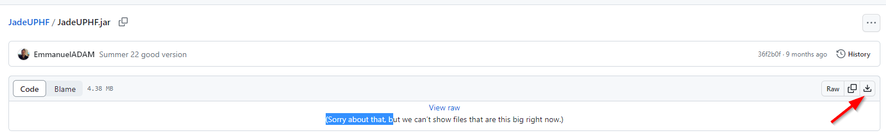
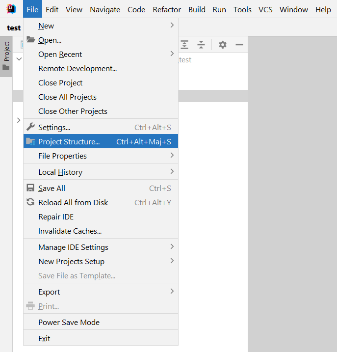
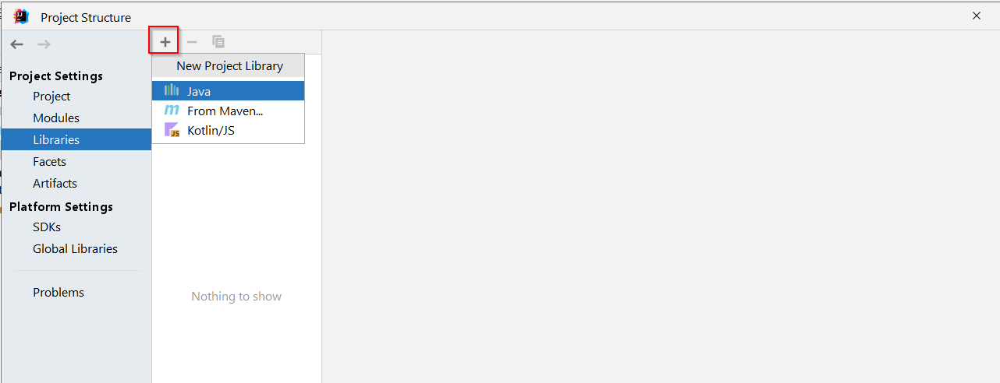
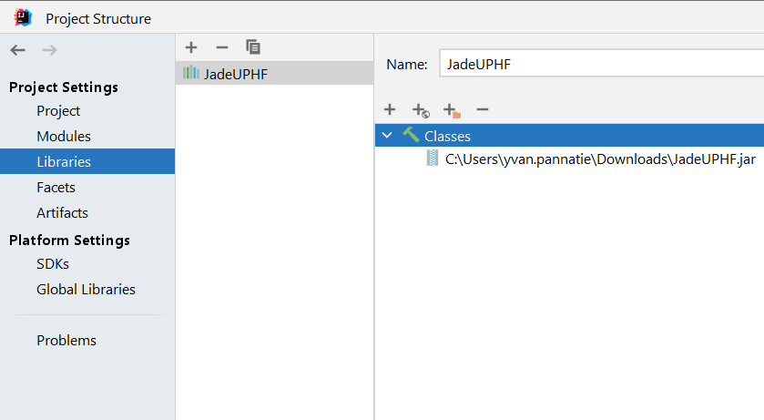
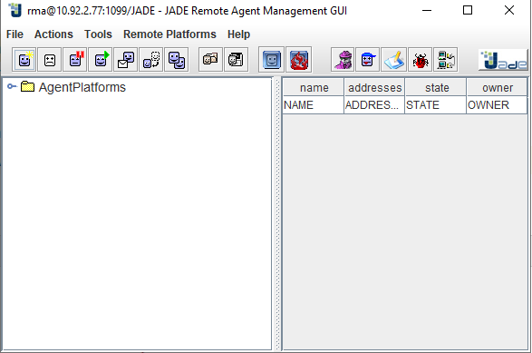
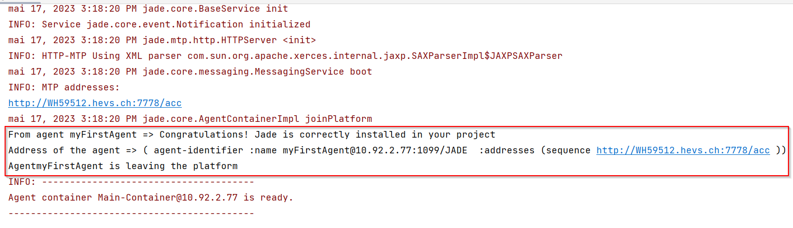

# 63-41_JADE-course-material

## Installation

1. Create a new java project in IntelliJ.
2. In the `src` package, create a new package `validation`.
3. Copy `Main.java` and `AgentHello.java` from `src/validation` of this project in the `validation` package of your project.
4. Go on `https://github.com/EmmanuelADAM/JadeUPHF/blob/master/JadeUPHF.jar` and download the `JadeUPHF.jar`:

5. In IntelliJ, go to `file/Project Structure`.

6. Under `Project Settings`, select `Libraries`. Click on `+` button and select `java`.

7. A file selector should open. Select the `JadeUPHF.jar` you downloaded and click `ok`. If a window asking you to add the library to a module opens, click `ok`.
8. The library should appears as on the following screen. Click on `Apply` and `ok`.

## Verification

1. Run your project from `Main.java` class.
2. The `JADE Remote Agent management GUI` should open:

3. The following output should appear in the `console`:

